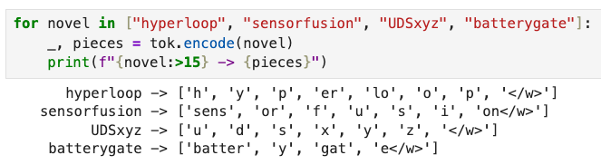
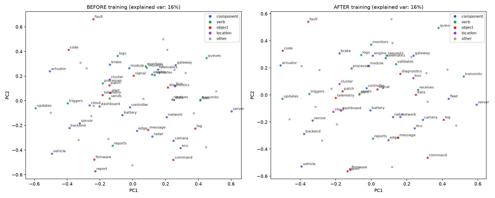

# GPT-Style Transformer from Scratch: SDV & IoT Context

## Overview

This repository contains a fully self-contained Jupyter notebook that builds a GPT-style transformer model entirely from scratch.

While the industry focus is often on building API wrappers around existing LLMs, this project dives into the low-level mechanics of generative AI. To test how these models process complex edge-to-cloud architectures, the model is trained on a custom synthetic Software-Defined Vehicle (SDV) and IoT corpus.

This project explores the intersection of traditional automotive or fleet tracking data pipelines and modern AI, demonstrating exactly how industry-specific jargon transforms into probabilistic outputs.

## Visualizing the Architecture

### 1. Tokenizing Domain Jargon

A look at how the custom Byte-Pair Encoding (BPE) tokenizer handles complex edge cases by breaking down novel words (like `sensorfusion` or `telematics`) into known sub-words.

### 2. Semantic Clustering in Vector Space

Using Principal Component Analysis (PCA) to flatten 32-dimensional embeddings into a 2D scatter plot. This visualizes how the model inherently maps relationships between various hardware and software components.

## Key Features

* **Custom BPE Tokenizer:** Demonstrates how novel domain jargon is processed gracefully to handle unexpected inputs.
* **Semantic Clustering Visualization:** Provides a tangible look at the semantic relationships between vehicle systems in the embedding space.
* **From-Scratch Architecture:** Implements multi-head causal self-attention, LayerNorm, and residual streams without relying on massive pretrained weights.
* **Self-Contained & CPU Friendly:** The entire training lifecycle runs in under a minute on a standard CPU, ensuring perfect architectural visibility and reproducibility.

## Motivation

As a Senior Solutions Architect with deep experience in IoT systems and connected architectures, I wanted to understand the "how" and "why" behind the current AI wave.

Integrating AI into technical pipelines requires more than just API calls. It requires understanding tokenization edge cases, semantic relationships in vector space, and the underlying data flow. This notebook serves as a sandbox to explore those mechanics using the data I work with every day.

## Getting Started

The notebook requires no large downloads or gated access.

1. Clone the repository.
2. Ensure you have standard data science libraries installed (`numpy`, `matplotlib`, `scikit-learn`, `torch`).
3. Run the notebook from top to bottom.

## Author

**Paritosh Mehta**
Senior Solutions Architect
